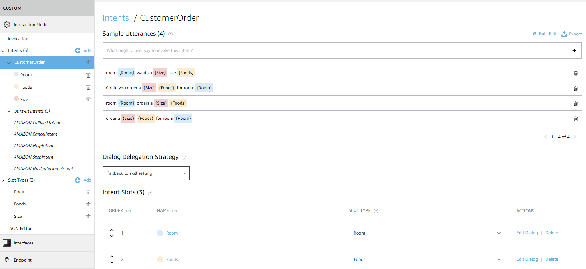
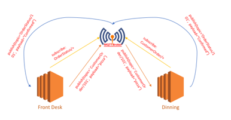

# Marriott-Lecture Example Application

This is a simple example application for Marriott Lecture. There are two versions of this application with regard to security concern. The purpose of this application is helping students obtain a basic understanding of IoT application and some common used techniques.

## Prerequisites

- EC2 Instance with Ubuntu 18.04
- DynamoDB
- AWS Lambda
- Alexa Echo
- IFTTT
- Philips Hue

## Application Scenario

The scenario of this application is processing customer foods ordering request based on Alexa Echo. The requests processing procedures consist of three parts, Alexa, FrontDesk and Dining. The FrontDesk plays the role of receiveing requests from Alexa(supported by AWS Lambda), generating order recipt, also relaying requests to Dining. Then Dining room can confirm order and start preparing foods, which is actually simulating the foods ordering procedures in real world. In addition, when the processing result is returned from the FrontDesk, Lambda function not only returns speech text to AVS, but also triggers two events pre-defined in IFTTT: emailing receipt to customer and lighting up the Philips Hue lamp.

## System Architecture

## Software Dependencies

- Python3
- MQTT
- Flask

## Key Techniques

- Alexa Custom Skill

    

- MQTT

    