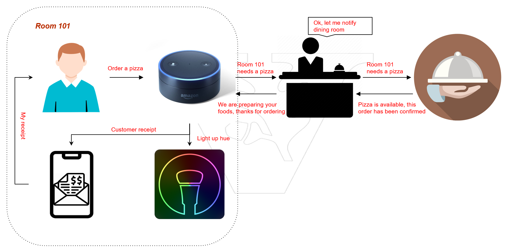
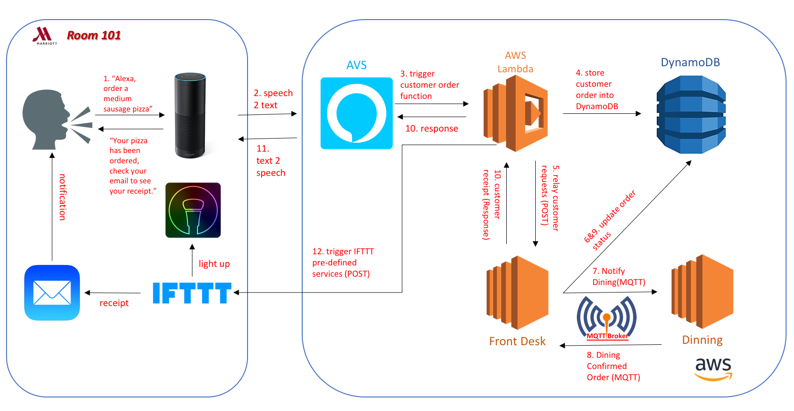

# Marriott-Lecture Example Application

This is a simple example application for Marriott Lecture. There are two versions of this application with regard to security concern. The purpose of this application is helping students obtain a basic understanding of IoT application and some common used techniques.

## Prerequisites

- EC2 Instance with Ubuntu 18.04
- DynamoDB
- AWS Lambda
- Alexa Echo
- IFTTT
- Philips Hue

## Application Scenario

The scenario of this application is processing customer foods ordering request based on Alexa Echo. The requests processing procedures consist of three parts, Alexa, FrontDesk and Dining. The FrontDesk plays the role of receiveing requests from Alexa(supported by AWS Lambda), generating order recipt, also relaying requests to Dining. Then Dining room can confirm order and start preparing foods, which is actually simulating the foods ordering procedures in real world. In addition, when the processing result is returned from the FrontDesk, Lambda function not only returns speech text to AVS, but also triggers two events pre-defined in IFTTT: emailing receipt to customer and lighting up the Philips Hue lamp.



## System Architecture



## Software Dependencies

- Python3
- MQTT
- Flask
- AWS CLI

```bash
# Firstly, follow slides in the following URL to setup your aws and required depedencies: 
#
# https://vanderbilt.box.com/s/q08pygoogobmqzgui1zc2o72kc6nce17 
#
# Now, you should have got into the en2 instance you just setup.
# 
# Clone the base repository
$ git clone git@github.com:VUZhuangweiKang/MarriottAppDev.git
# 
# Install software depedencies for FrontDesk and Dining
$ cd MarriottAppDev
$ sudo chmod +x requirements.sh
$ sudo su
$ ./requirements.sh
#
# Configure your aws cli in the ec2 instance, this commond will prompt you to enter your aws access key and the secert access key you just saved.
$ aws configure
# 
# Preparing lambda function zip file
$ cd Lambda
$ mkdir function & cd function
# For insecure version
$ pip3 install --upgrade ask_sdk_core ask_sdk_model requests simplejson --target .
# For secure version
$ pip3 install --upgrade ask_sdk_core ask_sdk_model requests simplejson pycryptodomex --target .
#
# copy the all other files in the Lambda directory into the function directory
$ cd ../
$ cp *.* ./function
# zip the function directory
$ zip -r9 function.zip function
# upload the zip file to Lambda web console
# speficy the handler field as: app.handler
```